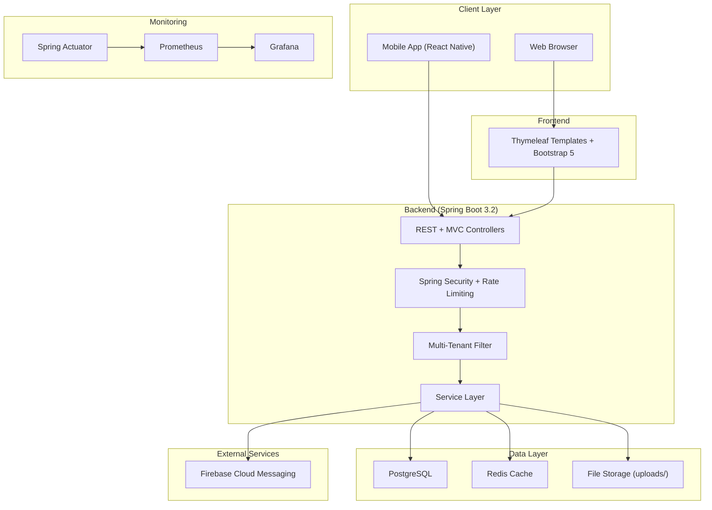
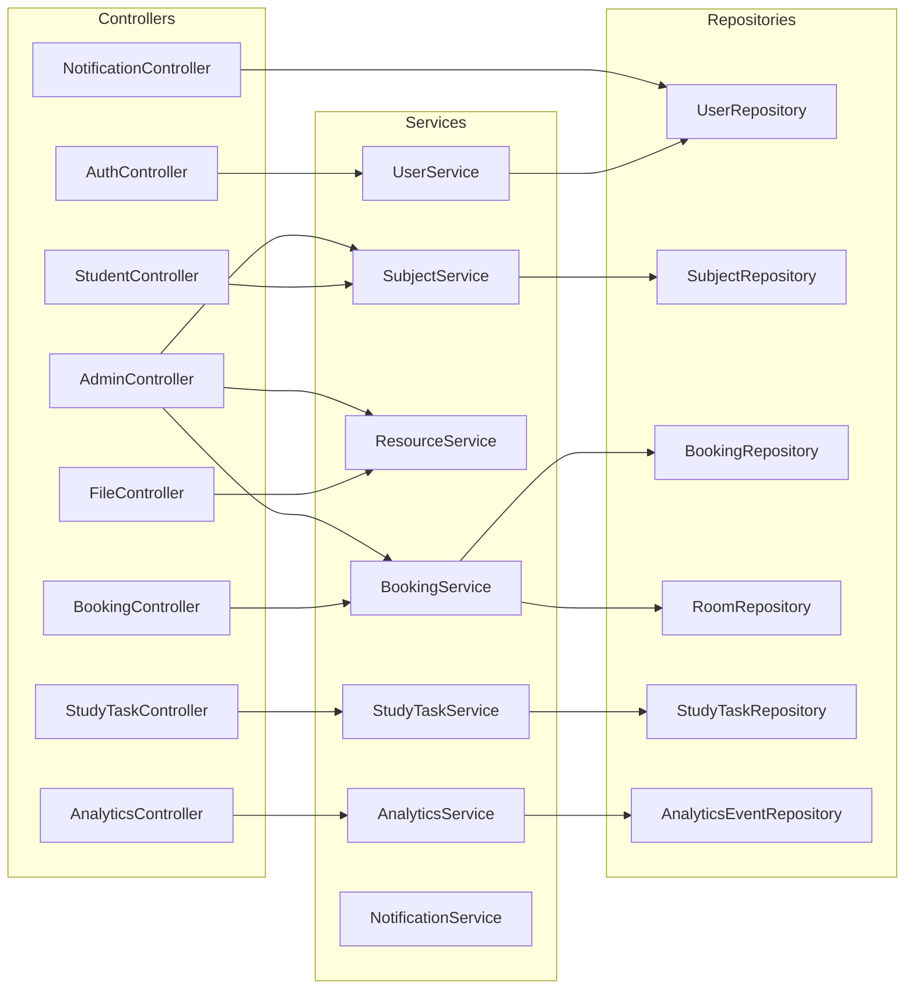
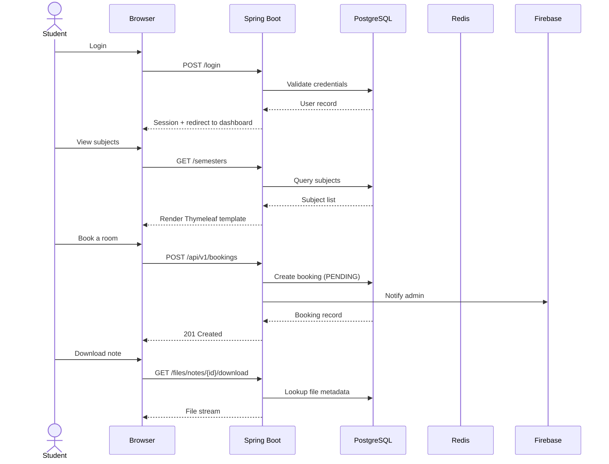
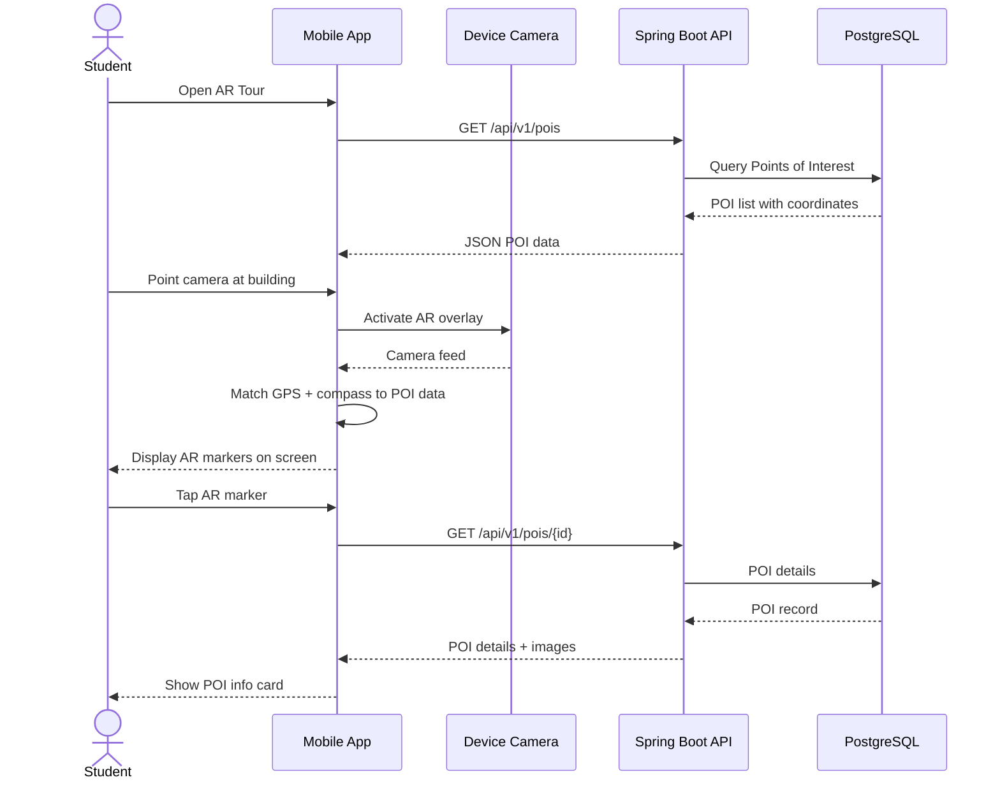

# System Architecture — Campus Study Hub

## 1. High-Level Architecture

## 2. Backend Component Architecture

## 3. Data Flow Diagram

## 4. AR Navigation Integration Flow

## Technology Stack Summary

| Component | Technology | Purpose |
| --- | --- | --- |
| Backend | Spring Boot 3.2, Java 17 | REST API + MVC |
| Frontend | Thymeleaf, Bootstrap 5 | Server-side rendered UI |
| Database | PostgreSQL 15 | Persistent storage |
| Cache | Redis | POI + QR code caching |
| Auth | Spring Security | Session-based auth |
| Monitoring | Prometheus + Grafana | Metrics + dashboards |
| Notifications | Firebase Admin SDK | Push notifications |
| Migrations | Flyway | Database schema versioning |
| CI/CD | GitHub Actions | Build, test, release |
| Container | Docker | Production deployment |
